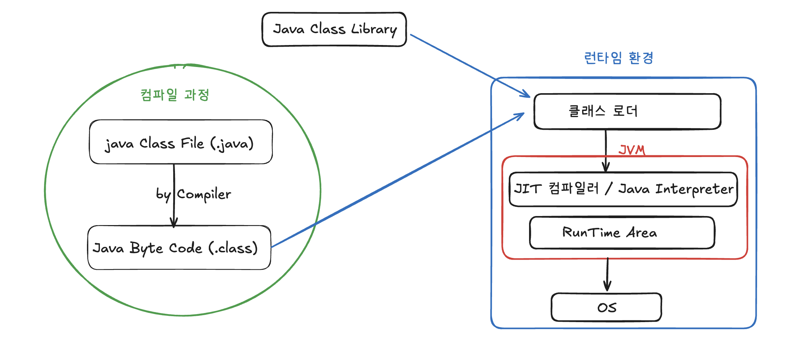
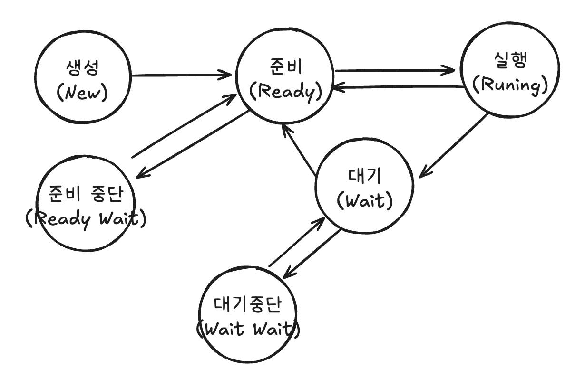
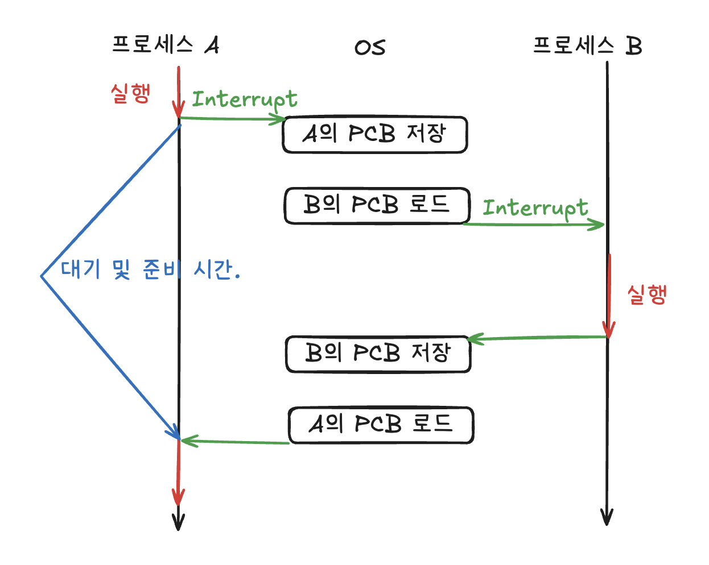

## 운영제체

운영체제(OS)는 사용자가 컴퓨터를 쉽게 다루기 위한 인터페이스입니다. 이는 하드웨어 자원을 효율적으로 관리하고 분배하는 역할을 수행합니다.

### 운영체제와 컴퓨터

#### 운영체제의 역할과 구조

1. **CPU 스케줄링과 프로세스 관리** : CPU 소유권을 어떤 프로세스에 할당할지, 프로세스의 생성과 삭제, 자원 할당 및 반환을 관리합니다.
2. **메모리 관리** : 한정된 메모리를 어떤 프로세스에 얼만큼 할당해야 하는지 관리합니다.
3. **디스크 파일 관리** : 디스크 파일을 어떠한 방법으로 보관할지 관리합니다.
4. **I/O 디바이스 관리** : I/O 디바이스들인 마우스, 키보드와 컴퓨터 간에 데이터를 주고받는 것을 관리합니다.

**시스템콜**  
시스템콜이란 유저 프로그램이 운영체제의 커널에 접근하기 위한 인터페이스입니다.

유저 프로그램이 I/O 작업을 위한 요청으로 트랩(trap)을 발동하면 올바른 I/O 요청인지 확인한 후, 유저 모드가 시스템콜을 통해 커널 모드로 변환되어 I/O 작업을 수행하게 됩니다.

- 이때 유저 모드에서 파일을 읽지 않고, 커널 모드로 들어가 파일을 읽은 뒤, 다시 유저 모드로 돌아가는 과정을 통해 **하드웨어 자원에 대한 직접적인 접근을 차단할 수 있으며, 다른 프로그램으로부터 보호**할 수 있게 됩니다.

#### 컴퓨터 요소

컴퓨터는 크게 CPU, 메모리, I/O 장치들로 이루어져 있습니다.

**CPU**  
CPU는 산술논리연산장치, 제어장치, 레지스터로 구성되어 있는 컴퓨터 장치를 말하며, 인터럽트에 의해 단순히 메모리에 존재하는 명령어를 해석해서 처리합니다.

**CPU의 연산 처리**

1. 제어장치가 메모리에 계산할 값을 로드합니다. 또한, 레지스터에도 로드합니다.

2. 제어장치가 레지스터에 있는 값을 계산하라고 산술논리연산장치에 명령합니다.

3. 제어장치가 계산된 값을 다시 '레지스터에서 메모리로' 계산한 값을 저장합니다.

- 인터럽트는 CPU가 프로그램 실행 중 **외부나 내부에서 발생하는 특별한 신호에 의해, 현재 작업을 중단하고 우선적으로 해당 상황을 처리**한 뒤 다시 원래 작업으로 돌아가도록 하는 컴퓨터 시스템의 핵심 기능입니다.

### 메모리

- 레지스터 : CPU 안에 있는 작은 메모리, 휘발성, 속도가 가장 빠르며 용량이 가장 적습니다.
- 캐시 : L1/L2 캐시를 지칭합니다. 휘발성, 속도가 빠르고 용량이 적습니다.
- 주기억장치 : RAM을 지칭합니다. 휘발성, 속도 보통, 용량이 보통입니다.
- 보조기억장치 : HDD, SSD를 말합니다. 비휘발성, 속도가 느리고 용량이 큽니다.

**캐시**  
캐시(cache)는 데이터를 미리 복사해 놓는 임시 저장소이자, 빠른 장치와 느린 장치에서 **속도 차이에 따른 병목 현상을 줄이기 위한 메모리를 말합니다**. 이를 통해 데이터를 접근하는 시간이 오래 걸리는 경우를 해결하고 무언가를 다시 계산하는 시간을 절약할 수 있습니다.

- **지역성의 원리** : 캐시의 적중률을 높이기 위해서는 자주 사용하는 데이터를 기반으로 캐시의 데이터를 저장해야합니다. 이에 따른 근거에는 두 가지가 존재합니다.
  - 시간 지역성 : 최근 사용한 데이터에 다시 접근하려는 특성을 말합니다.
  - 공간 지역성 : 최근 접근한 데이터를 이루고 있는 공간이나 그 가까운 공간에 접근하는 특성을 말합니다.

**웹 브라우저의 캐시**

- **쿠키** : 쿠키는 만료기한이 있는 키-값 저장소입니다. `same site` 옵션을 strict로 설정하지 않으면 다른 도메인에서 요청했을 때 자동 전송되며, 4KB까지 데이터를 저장할 수 있고 만료기한을 정할 수 있습니다. 쿠키를 설정할 때는 document.cookie 로 쿠키를 볼 수 없게 `httponly` 옵션을 거는 것이 중요합니다.
- **로컬 스토리지** : 로컬 스토리지는 만료기한이 없는 키-값 저장소입니다. 10MB까지 저장할 수 있으며 웹 브라우저를 닫아도 유지되고 도메ㅣㄴ 단위로 저장, 생성됩니다. 클라이언트에서만 수정 가능합니다.
- **세션 스토리지** : 세션 스토리지는 만료기한이 없는 키-값 저장소입니다. 탭 단위로 세션 스토리지를 생성하며, 탭을 닫을 때 해당 데이터가 삭제됩니다. 클라이언트에서만 수정 가능합니다.

#### 메모리 관리

운영체제의 대표적인 할 일 중 하나가 메모리 관리입니다. 한정된 메모리를 극한으로 활용하기 위해서입니다.

**가상 메모리**  
가상 메모리(virtual memory)는 메모리 관리 기법의 하나로 컴퓨터가 실제로 이용 가능한 메모리 자원을 추상화하여, 이를 사용하는 사용자들에게 매우 큰 메모리로 보이게 만드는 것을 말합니다.

이때 가상 주소(logical address)를 실제 메모리 상 주소(physical address)로 변환할 때 메모리 관리 장치(MMU)에 의해 변환됩니다. 이를 통해 실제 사용자들은 가장 주소를 기준으로 프로그램을 구축할 수 있게 됩니다.

가상 메모리는 가상 주소와 실제 주소가 매핑되어 있고 프로세스의 주소 정보가 들어 있는 '페이지 테이블'로 관리됩니다. 이때 속도 향상을 위해 TLB를 사용합니다.

- TLB : 메모리와 CPU 사이에 있는 주소 변환을 위한 캐시입니다. 페이지 테이블까지 CPU가 접근하지 않도록 하여 속도를 향상시킬 수 있습니다.

**스와핑**  
만약 가상 메모리에는 존재하지만 실제 메모리인 RAM에는 현재 없는 데이터나 코드에 접근할 경우 페이지 폴트가 발생합니다. 이때 메모리에서 당장 사용하지 않는 영역을 하드 디스크로 옮기고 하드 디스크의 일부분을 마치 메모리처럼 불러와 쓰는 것을 스와핑(swapping)이라고 합니다.

1. CPU는 물리 메모리를 확인하여 해당 프레임이 존재하지 않으면, 트랩을 발생해서 운영체제에 알립니다.
2. 운영체제는 CPU의 동작을 잠시 멈춥니다.
3. 운영체제는 페이지 테이블을 확인하여 가상 메모리에 페이지가 존재하는지 확인하고, 없으면 프로세스를 중단하고 현재 물리 메모리에 비어 있는 프레임이 있는지 찾습니다. 물리 메모리에도 없다면 스와핑을 통해 기존 프레임을 디스크에 저장하고 비웁니다.
4. 비운 프레임에 해당 페이지를 로드하고, 페이지 테이블을 최신화합니다.
5. 중단되었던 CPU를 다시 시작합니다.

---

#### 메모리 할당

메모리에 프로그램을 할당할 때는 시작 메모리 위치, 메모리의 할당 크기를 기반으로 할당하는데, 연속 할당과 불연속 할당으로 나뉩니다.

**연속 할당**  
연속 할당은 메모리에 '연속적으로' 공간을 할당하는 것을 말합니다.

- **고정 분할 방식** : 메모리를 미리 나누어 관리하는 방식이며, 메모리가 미리 나뉘어 있기 때문에 융퉁성이 없습니다. 또한 내부 단편화가 발생하게됩니다.
- **가변 분할 방식** : 매 시점 프로그램의 크기에 맞게 동적으로 메모리를 나누어 사용합니다. 내부 단편화는 발생하지 않고, 외부 단편화는 발생할 수 있습니다.

**불연속 할당**  
메모리를 연속적으로 할당하지 않는 불연속 할당은 현대 운영체제가 쓰는 방법으로 불연속 할당인 페이징 기법이 있습니다. 메모리를 동일한 크기의 페이지(보통 4KB)로 나누고 프로그램마다 페이지 테이블을 두어 이를 통해 메모리에 프로그램을 할당하는 것. **이를 통해 외부 단편화 현상을 없앨 수 있습니다**.

### 프로세스와 스레드

프로세스(process)는 컴퓨터에서 실행되고 있는 프로그램을 말하며, CPU 스케쥴링의 대상이 됩니다. 스레드는 프로세스 내 작업의 흐름을 지칭합니다.

#### 프로세스와 컴파일 과정.

프로그램은 컴파일러가 컴파일 과정을 거쳐 컴퓨터가 이해할 수 있는 기계어로 번역되어 실행할 수 있는 파일이 되는 것을 의미합니다.

1. **전처리** : 소스코드의 주석을 제거하고 #include 등 헤더 파일을 병합하여 매크로를 치환합니다.
2. **컴파일러** : 오류 처리, 코드 최적화 작업을 하며 어셈블리어로 변환합니다.
3. **어셈블러** : 어셈블리어는 목적 코드(object code)로 변환됩니다.
4. **링커** : 프로그램 내에 있는 라이브러리 함수 또는 다른 파일들과 목적 코드를 결합하여 실행 파일을 만듭니다.

- **정적 라이브러리** : 프로그램 빌드 시 라이브러리가 제공하는 모든 코드를 실행 파일에 넣는 방식이며, 시스템 환경 등 **외부 의존도가 낮지만 코드 중복 등 메모리 효율성이 떨어지는 단점**이 있습니다.
- **동적 라이브러리** : 프로그램 실행 시 필요할 때만 DLL이라는 함수 정보를 통해 참조하는 방식이며, **메모리 효율성에서의 장점과 외부 의존도가 높아진다는 단점**이 있습니다.

#### 참고 : Java 프로세스 컴파일과 실행.

- Java 역시 클래스 로더를 통해 작성한 클래스 파일과 라이브러리 클래스 또는 외부 라이브러리를 JVM의 메모리(Runtime Data Area)에 로드하게 됩니다.
  - `Runtime Data Area` 는 Heap, Stack, Static Method, Native Method, PC Register 영역으로 구성됩니다.
- 로드된 클래스 파일은 Compiler/Interpreter 를 통해 하드웨어가 이해할 수 있는 **기계어로 변환**되게 됩니다.

#### 프로세스의 상태

- 생성(New)
  - 프로세스가 생성된 상태를 의미하며, _fork()_ 또는 _exec()_ 함수를 통해 생성합니다. 이때 PCB가 할당됩니다.
- 준비(Ready)
  - 메모리 공간이 충분하면 메모리를 할당받고, 아니면 아닌 상태로 대기하고 있으며 CPU 스케줄러로부터 CPU 소유권이 넘어오기를 기다리는 상태입니다.
- 준비 중단
  - 메모리 부족으로 일시 중단된 상태.
- 실행(Running)
  - CPU 소유권과 메모리를 할당받고 인스트럭션을 수행 중인 상태를 의미합니다.
- 대기(Waiting)
  - 어떤 이벤트가 발생한 이후 기다리며 프로세스가 차단된 상태입니다. I/O 디바이스에 의한 인터럽트로 이런 현상이 많이 발생합니다.
- 대기 중단
  - 대기중인 프로세스가 준비 상태로 넘어갈 때, 메모리가 부족하여 일시 중단된 상태입니다.

---

#### 프로세스의 메모리 구조

**스택**  
스택에는 지역변수, 매개변수, 함수가 저장되고 컴파일 시에 스택의 최대 크기가 결정되며, 동적인 특징을 갖습니다.

스택 영역은 함수가 함수를 재귀적으로 호출하면서 동적으로 크기가 늘어날 수 있는데 이때 힙과 스택의 메모리 영역이 곂치는 것을 방지하기 위해 힙과 스택 사이의 공간을 비워둡니다.

**힙**  
힙은 동적 할당할 때 사용되며 런타임 시 크기가 결정됩니다.

**데이터 영역**  
데이터 영역은 전역 변수, 정적변수가 저장되고, 정적인 특징을 갖는 프로그램이 종료되면 사라지는 변수가 들어 있는 영역입니다.

**코드 영역**  
코드 영역은 프로그램에 내장되어 있는 소스 코드가 들어가는 영역입니다. 이 영역은 수정 불가능한 기계어로 저장되어 있으며 정적인 특징을 가집니다.

---

#### PCB

*PCB(Process Control Block)*은 운영체제에서 프로세스에 대한 메타데이터를 저장한 '데이터'를 말합니다. 프로세스 제어 블록이라고도 합니다. 프로세스가 생성되면 운영체제는 해당 PCB를 생성합니다.

프로그램이 실행되면 프로세스가 생성되고 프로세스 주소 값들에 프로세스의 메모리 영역이 할당됩니다. 그리고 이 프로세스의 메타데이터들이 PCB에 저장되어 관리됩니다. 이는 프로세스의 중요한 정보를 포함하고 있기 때문에 일반 사용자가 접근하지 못하도록 커널 스택의 가장 앞부분에서 관리됩니다.

**PCB의 구조**

- 프로세스 스케줄링 상태 : '준비', '일시중단' 등 프로세스가 CPU에 대한 소유권을 얻은 이후의 상태.
- 프로세스 ID : 프로세스 ID, 해당 프로세스의 자식 프로세스 ID
- 프로세스 권한 : 컴퓨터 자원 또는 I/O 디바이스에 대한 권한 정보
- 프로그램 카운터 : 프로세스에서 실행해야 할 다음 명령어의 주소에 대한 포인터
- CPU 레지스터 : 프로세스를 실행하기 위해 저장해야 할 레지스터에 대한 정보
- CPU 스케줄링 정보 : CPU 스케줄러에 의해 중단된 시간 등에 대한 정보

---

### IPC

멀티프로세스는 IPC(Inter Process Communication)가 가능하며 IPC는 프로세스끼리 데이터를 주고받고 공유 데이터를 관리하는 메커니즘을 뜻합니다.

클라이언트는 데이터를 요청하고 서버는 클라이언트 요청에 응답하는 것 역시 IPC의 예입니다.

IPC의 종류로는 공유 메모리, 파일, 소켓, 익명 파이프, 명명 파이프, 메시지 큐가 있습니다. 이들 모두 스택을 제외한 메모리 영역을 공유하는 스레드보다는 속도가 떨어집니다.
